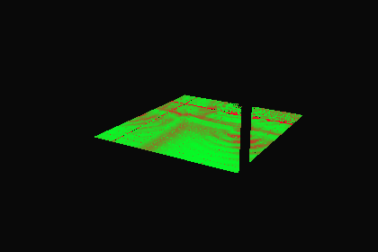

# 水上の到達先を水面上の全周参照で引いたときの視差（2026-09-26）

前回の[到達先の分類](../water-reflection-targets/README.md)で、水中の到達点の鏡面ローブの55%が水面を抜けて水上の物体に届くと分かった。今回は、水面の上に置いた全周（キューブ）参照でその到達先を引いたとき、同じ物体・位置が返るかを測る。**幾何の一致の診断で、放射輝度・色は計算していない。製品・配信データは変更していない。暗い帯の修正は未完了。**

## 測定条件

- Blender 4.5.11 LTS、元blend。入力は [water-side-continuation](../water-side-continuation/) の元形状の到達点10,056点（カメラ03）。前回と同じ到達点・粗さ・乱数種で鏡面ローブを64方向ずつ引き直し、`water_reflection_trace.py` で元の水形状に通した（Fresnel分岐・最大8境界）。光源は交差させない（前回の光源0.1%は背後の物体として扱う）。昼の形状のみ（到達先の幾何は時間帯で変わらない）。
- 対象は水から出た最後の区間（起点は水の境界上、方向、真の到達点）のうち、水上の物体に当たるもの（`above_water`、ローブ重みの54.9%）と何にも当たらないもの（`sky`、7.9%）。前回の55.1%／7.1%と整合する（光源の扱いの差）。
- 候補の参照（プローブの位置 `C` と参照方向 `L`）：
  - `center_h*`：浴槽中央、水の上面（z=0.771）の2／10／30cm上の1点。`L` は区間の方向そのまま（無限遠の全周参照）。
  - `gridNxM`：水のXY範囲の格子（高さ10cm）で、区間の起点に最も近いプローブ。`L` は方向そのまま。
  - `box_*`：箱補正（区間が箱を出る点をプローブから見た方向）。箱は各プローブから±X・±Yの軸方向のレイで最初に当たる面（浴槽の内壁）まで、上は空（50m）、下は水底。
  - `nested_*`：2段の箱補正。浴槽の箱の上面を四方の壁の上端の最低値で打ち切り、上面から出た区間は外側の中庭の箱（同じXYで水面1m上から軸方向のレイ：−Xガラス壁、+Y `Garden enclosure`、+X庭の壁、−Y奥の木）へ続ける。
- 判定：`C` から `L` へ追って返る物体・位置を真の到達点と比べる（同一物体かつ2cm／10cm以内。空は両方とも何にも当たらない場合に一致）。あわせて、`L` と `C` から真の到達点への方向との角度差（参照方向の誤差）、`C` から真の到達点が見えるか（どの補正でも越えられない上限）を記録。可視性は真の区間と同じ光線種別（水から出た後はtransmission）。

## 結果

水上の物体に届く鏡面（ローブ重み）のうちの割合（%）。空は同じ判定で空が返る割合。

| 参照 | 10cm以内 | 2cm以内 | 同一物体 | 角度差<2° | <5° | <10° | 角度差の中央値 | 空の一致 |
| --- | ---: | ---: | ---: | ---: | ---: | ---: | ---: | ---: |
| 中央1点・10cm上（方向のみ） | 0.4 | 0.0 | 36.3 | 1.0 | 4.9 | 18.4 | 21.6° | 88.5 |
| 格子3×3（方向のみ） | 3.8 | 0.2 | 49.5 | 3.9 | 19.4 | 47.0 | 10.9° | 93.1 |
| 中央1点・浴槽の箱 | 35.3 | 15.0 | 81.6 | 35.9 | 60.8 | 77.8 | 3.4° | 85.6 |
| 格子3×3・浴槽の箱 | 49.3 | 29.4 | 87.2 | 47.6 | 77.7 | 90.6 | 2.2° | 91.1 |
| **中央1点・2段の箱** | **75.6** | 63.4 | 77.3 | 73.2 | **81.2** | 88.5 | 0° | 92.4 |
| **格子3×3・2段の箱** | **87.9** | 79.5 | 90.0 | 85.0 | **90.3** | 94.3 | 0° | 94.9 |
| 格子4×6・2段の箱 | 91.1 | 86.2 | 92.2 | 91.5 | 94.9 | 96.6 | 0° | 95.2 |
| 上限（プローブから見える） | 96.9 | | | | | | | |

- 水から出た区間の長さは中央値1.6m（90百分位3.0m）で、中央プローブと区間の起点の水平のずれ（最大約2.1m）と同程度。**方向だけで引く参照は角度差の中央値が10〜22°**で、水から出たローブの広がり（点ごとの平均方向からの偏差の中央値、全点の中央値6.9°）より大きく、使えない。高さ2〜30cmの差はほぼない。
- **浴槽の内壁だけの箱補正**は内壁（`Plunge end/side basalt` 82〜100%）を取れるが、最大の到達先の奥の `Garden enclosure`（水上の重みの38%）とガラス壁（15%）は壁の上を越えるため1〜21%しか取れない。
- **2段の箱補正**で両方を取れる（中央1点で `Garden enclosure` 96%、ガラス壁96%）。中央1点の残差は縁石（`Honed pool coping` 0%）・注水口（0%）。中央プローブの+Y方向の最初の壁が注水の流れ（上端0.925m）で、浴槽の箱の上面が縁石の上端1.035mより低く打ち切られるため。格子3×3（プローブごとの箱の上面1.035m）では縁石59〜85%。
- 領域別（10cm以内、2段の箱）：底のタイル 中央1点78%／格子3×3 90%、側面全反射のタイル 77%／88%。側面透過の区間は61〜69%で、どの候補でも低い（重みは水上全体の0.1%）。
- 前回の割合と組み合わせた概算：既存の真上参照（28.1%）＋空（7.9%×92%）＋水上（54.9%×75.6%）で、到達点の鏡面の**約77%**（中央1点）、格子3×3なら約84%を参照で表せる幾何になる（前回の35%から）。平均の積であり点ごとの結合ではない。



中央1点・2段の箱で、水から出た鏡面（水上＋空）のうち10cm以内に一致した割合（緑＝一致、赤＝不一致）。残りは奥の縁と波紋状の帯。ほかは [方向のみ](match-center_h0.10.png)・[格子3×3の浴槽の箱](match-box_grid3x3.png)・[格子3×3の2段の箱](match-nested_grid3x3.png)。全測定値・プローブごとの箱・物体別・領域別は [capture.json](capture.json)。

## 判断

- 水上の到達先は、**水面上の全周参照を2段の箱（浴槽の内壁＋中庭）で補正すれば中央1点でも大半を幾何的に取れる**。方向だけの参照や浴槽の箱だけでは取れない。
- 1点と格子の差（75.6%→87.9%）は主に縁石と注水口。格子は参照の枚数（昼夕×9枚）と補間の継ぎ目が増えるため、まず中央1点（浴槽の箱の上面を縁石の上端に合わせる）を試作候補とする。
- 次は、この参照の試作でCyclesのキューブ（中央1点・2段の箱）を描き、到達点の水上成分の放射輝度（前回の [water-radiance](../water-radiance/README.md) の `GlossInd` 相当）と比べて色の誤差を測る。前処理（粗さごとのぼかし）・解像度・昼夕2枚の容量もそこで決める。

## 限界

- 幾何の一致だけ。10cm以内でも向き・照明の違いで色は変わり、不一致でも似た色の場合がある。放射輝度で重み付けしていない。
- 最近傍のプローブだけを使い、プローブ間の補間・継ぎ目は評価していない。箱は軸方向のレイ4本（＋上下）から決めた軸平行の直方体で、実際の中庭の形（斜めの面・木）とはずれる。
- 参照は真の区間と同じ光線種別で引いた。実際のキューブをカメラで描く場合、カメラ可視性が異なる物体は別途確認が要る。
- 単散乱GGX・スカラーF0・幾何法線・滑らかな水・カメラ03の静止した元形状（前回と同じ）。製品の水の形状（波＋箱）での同じ測定は行っていない。

## 再実行

```sh
/Applications/Blender.app/Contents/MacOS/Blender -b blender/scene/SUI_Retreat.blend --python-exit-code 1 --python scripts/diagnose_water_above_capture.py -- --out docs/3d-qa/water-above-capture
python3 -m unittest discover -s scripts -p 'test_*.py'
```

CPUのBVH追跡のみで約5分（描画なし）。`--samples` で方向数、`--limit N` で先頭N点だけの試走。入力blend・経路・GLB・スクリプトと補助モジュールのハッシュを `capture.json` に記録し、元blendの実行前後の一致を確認する（`source_unchanged`）。元blendは保存しない。
