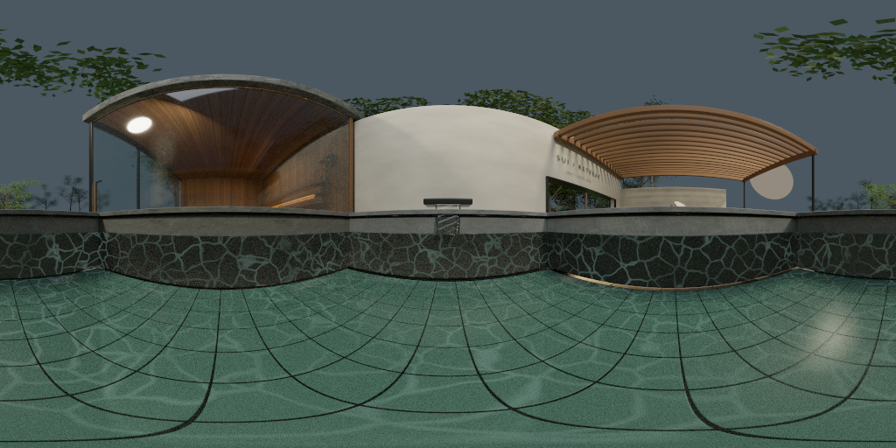

# 水面上の全周参照の色の誤差（2026-09-26）

前回の[視差の診断](../water-above-capture/README.md)で候補にした「浴槽中央・水面10cm上の1点、浴槽の箱＋中庭の箱の2段の箱補正」の全周参照をCyclesで描き、水中の到達点の鏡面ローブのうち水から出た成分（水上の物体・空）の**真の放射輝度**と比べた。**Cyclesでの色の診断で、製品・配信データは変更していない。暗い帯の修正は未完了。**

## 測定条件

- Blender 4.5.11 LTS、元blend、Metal GPU。到達点は [water-side-continuation](../water-side-continuation/) の元形状（カメラ03）から、前々回の[局所HDR色](../water-radiance/README.md)の19点と、全10,056点を画面順に等間隔で選んだ48点の計67点。
- 各到達点で前回と同じ粗さ・乱数種で鏡面ローブを64方向引き直し、元の水形状に通した（Fresnel分岐・最大8境界）。水から出た終端（`above_water`・`sky`）6,091本が対象。ローブ重みに占める割合は到達点の中央値67.8%。
- **真値**：各終端の到達点の1mm手前に10µm四方の正投影カメラを置き、最後の区間の向きで5×5画素・256サンプルを描いて全画素を平均（6,400サンプル相当）。空の終端は区間の起点から描く。Positionパスが到達点から0.1mmを超えた175本（重み2.87%、縁石の隙間・注水の流れの縁）は真値・参照の両方から除く。
- **参照**：プローブ（Blender (1.18, 2.50, 0.871)）でequirectangular 2048×1024・256サンプルを昼夕・seed 17/83の2枚ずつ描いた（1枚約3.5分）。方向の対応はCyclesで較正し、Positionパスで検査（誤差の中央値0.0006テクセル）。
- 両方とも、カメラレイに各物体の**透過レイの可視性**を与える（水から出た後の区間は透過レイ）。水はカメラからだけ隠し、浴槽への照明は残す。**ブラウザが自前でハイライトを描く光源（V9、夕暮れの暖色灯5灯）は、反射プローブの焼き込みと同じく両方から外した**（V9は放射輝度211の面で、含めるとパノラマの明るさの65%が50テクセルに集中する）。
- 引き方：終端ごとに2段の箱で補正した方向で参照を双線形で引く。浴槽の箱の上面は、前回の測定値（注水の流れの上端0.925m）と、前回の判断どおり縁石の上端（1.035m）の2通り。比較に方向だけ（補正なし）も入れた。
- 誤差：到達点ごとに水から出た鏡面 (1/N)Σ重み×放射輝度 を真値と参照で求め、RGB絶対差の合計を真値のRGB合計で割る。昼夕で別に集計。水から出る終端のない2点は除く（65点）。
  - **モンテカルロ（MC）**：同じ終端ごとに参照を引く（参照の理想的な使い方）。
  - **プリフィルタ**：参照をvon Mises–Fisherローブでぼかした画像を、終端の参照方向の重み付き平均の向きで1回だけ引く。ぼかしの強さは同じ方向群の集中度κから決める（事前にぼかした環境マップを粗さで引く方式の近似）。

## 結果

到達点ごとの誤差（水から出た成分の真値に対する割合、中央値／90百分位）。

| 引き方 | 昼 | 夕 |
| --- | --- | --- |
| 真値の雑音（画素を半分ずつに分けた差） | 0.4% / 1.4% | 0.3% / 1.0% |
| 参照の雑音（2seedの差） | 0.3% / 1.0% | 0.2% / 1.2% |
| 方向だけ（MC） | 25.6% / 259% | 22.3% / 251% |
| 2段の箱・上面0.925m（MC） | 10.6% / 45.8% | 8.6% / 52.1% |
| **2段の箱・上面を縁石1.035m（MC）** | **5.6% / 24.1%** | **5.1% / 22.6%** |
| 同・プリフィルタ1回 | 16.7% / 67.9% | 15.5% / 84.2% |

- **浴槽の箱の上面を縁石の上端に合わせると誤差が半分になる**（10.6%→5.6%）。描いた参照で幾何を確かめても、10cm以内で一致する重みは76.5%→83.6%（方向だけでは0.2%）。前回のレイ追跡の75.6%と整合する。
- 終端1本ずつの誤差は水上で中央値11〜12%・90百分位276〜323%と大きいが、ローブで積分すると上のとおり小さくなる。90百分位の残差は箱と実際の形状（木・斜めの面・縁石と注水口）のずれによる。
- **解像度**：縁石版のMCは参照を縮小しても幅128（128×64、キューブなら1面32相当）まで中央値4.9〜6.4%・90百分位23〜24%でほとんど変わらない。幅64で7.2〜7.7%・26〜29%、幅32で8.0〜8.5%・40〜59%に悪化する。
- **プリフィルタ1回の引き方は誤差が約3倍**（中央値16%・90百分位68〜84%）。MCとの差も中央値14〜19%。水から出たローブは広く（κの中央値18、標準偏差でおよそ13°）、水面の屈折と箱の補正で平均の向きのまわりに対称に広がらないため、1方向のぼかしでは表せない。
- **19点のCombinedに対する割合**（前々回と同じ分母）：水から出た成分を省くと中央値8.3%／13.1%（昼／夕）、平均31〜32%、90百分位50〜59%の誤差になる。縁石版のMCでは中央値0.3〜0.4%・90百分位2.2〜3.1%、プリフィルタ1回では中央値1.3〜1.5%・90百分位8.1〜9.6%・平均3.7〜5.4%。
- **容量**（半精度RGBA・ミップ込み、1枚あたり）：幅128のequirectangularで約87KB、幅256で約350KB。キューブ1面32で約64KB、64で約262KB。昼夕で2倍。



参照（昼、2048×1024を1024×512に縮小）。表示はx/(1+x)の固定トーンカーブとsRGB変換だけで、画像ごとの正規化はしない。水をカメラから隠しているため浴槽の内壁・底が見えている。[夕暮れ](capture-evening.png)は露出4倍。全測定値は [summary.json](summary.json)（到達点ごとの値・19点の行を含む）。

## 判断

- 2段の箱（浴槽の箱の上面を縁石の上端に合わせる）の中央1点の参照は、**終端ごとに補正方向で引けば**、水から出た鏡面を中央値5%・Combined比で中央値0.4%以内まで表せる。解像度は幅128（キューブ1面32）で足り、昼夕2枚で200KB未満。前処理としての粗さ別のぼかしは不要。
- ただし、事前にぼかした参照を1方向で引く通常の環境マップの使い方では誤差が約3倍になり、Combined比の90百分位で約9%残る。**参照そのものではなく、ローブの積分の仕方が次の課題**。次は、水中の到達点で少数の方向（例：4〜16本）を水面で屈折させて箱で補正して引いた場合の本数と誤差の関係を、同じデータで測る（終端に元の標本番号を残す必要がある）。
- 19点のうち2点（11・8、側面全反射の後のタイルと基壇）で、この光学モデルが予測する水から出た成分が、Cyclesの鏡面パス全体（`GlossCol×(GlossDir+GlossInd)`）の3〜8倍になった。どちらも日の当たる `Garden enclosure`（放射輝度約0.75）へ大きな重みで抜ける。単散乱GGX・スカラーF0・幾何法線の近似か、元シーンの設定（間接光のクランプ10、Filter Glossy 1.0）のどちらによるかは未確認。**参照と真値は同じモデルで比べているため上の誤差には影響しないが、Combined比の「省いた場合」の値はこの2点で過大**。製品へ入れる前にCyclesのパスと突き合わせる。

## 限界

- 到達点67点・カメラ03の静止した元形状だけ。65点を等重みで集計し、画面上の面積では重み付けしていない。19点は層化標本で、無作為標本ではない。
- 真値もローブの重みも前回までと同じ近似（単散乱GGX・スカラーF0・幾何法線・滑らかな水・光源は交差させない）。上のとおり2点でCyclesの鏡面パスと合わない。
- 水中側の成分（真上・面座標の参照）とは組み合わせていない。Combined比は水から出た成分だけの誤差。
- V9・夕暮れの暖色灯5灯は両方から外した。これらの光の、水を通った鏡面ハイライトは別途扱う必要がある。
- プリフィルタはvMFの近似で、threeのPMREM（GGXローブ）そのものではない。箱補正と組み合わせたときの継ぎ目・動く波・GPU費用・別視点は未評価。

## 再実行

```sh
/Applications/Blender.app/Contents/MacOS/Blender -b blender/scene/SUI_Retreat.blend --python-exit-code 1 --python scripts/diagnose_water_capture_radiance.py -- --out blender/diagnostics/water-capture-radiance --width 2048 --capture-samples 256 --truth-samples 256
python3 scripts/summarize_water_capture_radiance.py blender/diagnostics/water-capture-radiance --out docs/3d-qa/water-capture-radiance
python3 -m unittest discover -s scripts -p 'test_*.py'
```

Blenderは約37分（パノラマ4枚で約15分、真値12,182枚で約23分）。出力（EXR・npy・`terminals.json.gz`、約310MB）はGit管理外。集計は約2分。入力blend・経路・前回の `capture.json`・GLB・スクリプトと補助モジュールのハッシュを記録し、元blendの実行前後の一致を確認する（`source_unchanged`）。元blendは保存しない。`--limit N` で先頭N点だけの試走。
