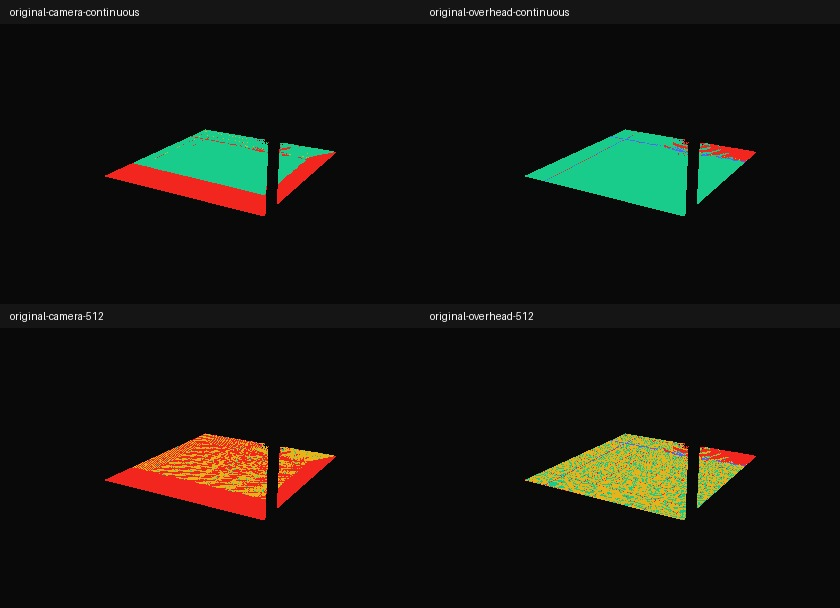

# 水中の未屈折描画から色を参照するための可視性検証

前回の[到達経路](../water-side-continuation/README.md)を入力に、到達先を色・深度画像から参照できるかを幾何で評価する。**HDR画像そのものはまだ描いていない。製品の暗い帯は未修正。**

## 条件

- 元blend、カメラ03、420×280の可視水面10,058点。元形状／波＋箱の両方の到達位置を使用。
- `camera`：同じカメラの未屈折描画。水を除外するが、他のカメラ可視な形状は残す。
- `overhead`：元水形状のXY境界に各20cmの余白を付けた正投影。水形状の上端+10cmから下へ描く想定で、それより上の建築はクリップする。水以外は除外しない。
- 連続座標でのレイ（可視性の上限）と、512／1024幅の最近傍テクセルを比較。cameraは元画像の縦横比、overheadは正方形。補間・MSAA・バイアスは未使用。
- 参照画像の最前面が**同じオブジェクトかつ到達位置から2mm以内／10mm以内**なら一致。閾値は診断用で、見た目の合格基準ではない。
- 一致点について、参照カメラの視線と元経路の最後の区間との角度差も記録する。これは鏡面の色誤差の測定ではない。

結果の数値は [coverage.json](coverage.json)。PNGは元の水面画素へ判定を戻した図で、緑=2mm以内、黄=2〜10mm、赤=不一致、青=画面外、紫=経路未解決。水の完成画像ではない。

## 測定結果と判断（2026-09-25）

Blender 4.5.11 LTS。元形状の経路を基準にした結果：

| 参照方法 | 全10,058点の2mm以内 | 全10,058点の10mm以内 |
| --- | ---: | ---: |
| 同視点・連続座標 | 5,917 (58.83%) | 5,954 (59.20%) |
| 真上・連続座標 | 9,338 (92.84%) | 9,344 (92.90%) |
| 真上・512² | 2,768 (27.52%) | 9,020 (89.68%) |
| 真上・1024² | 8,793 (87.42%) | 9,164 (91.11%) |
| 2方向の併用・連続座標 | 9,810 (97.53%) | 9,821 (97.64%) |
| 2方向の併用・幅512 | 2,913 (28.96%) | 9,515 (94.60%) |
| 2方向の併用・幅1024 | 8,944 (88.92%) | 9,707 (96.51%) |

- 同視点の未屈折画像だけでは約41%を2mm以内で参照できない。画像で手前と右の欠落を確認した。
- 真上の連続座標では側面全反射1,726点中1,704点（98.73%）が2mm以内。一方、側面透過581点は31点（5.34%）だけ。主な遮蔽物は内壁の `Plunge end basalt.001`。真上の画像を高解像度にするだけでは垂直壁への参照は解決しない。
- 2方向を併用しても連続座標で237点が10mm以内に入らない。実装には位置／深度の検証と明示的なフォールバックが必要。2方向併用は参照の可否だけの集計で、実際の色の継ぎ目は未検証。
- 真上の2mm一致点でも、色を描く方向と最後の透過区間の方向差は中央値68.74°・90百分位72.24°。照度・発光を位置で参照する案は残るが、既存の鏡面成分を含むHDR色をそのまま再利用する根拠にはならない。
- 512²は平面上でもテクセル中心が数mmずれる。2mmの厳密な位置判定では大半が不一致となる。位置に応じた補間・画素の占有範囲・境界をまたがない深度判定が必要で、単純な2mm判定を製品に持ち込まない。
- 波＋箱の併用結果は連続座標で2mm以内9,818点、幅1024で8,928点。これはその候補自身の到達位置を参照できる割合であり、元形状との像の一致率ではない。



次は製品から分離したHDR試作で、真上の拡散・発光を主に使い、内壁を別投影または面の座標で補完する方式を比較する。鏡面は実際の最後の光線方向で評価するか、省略の誤差を個別に測る。無効な参照先の色をそのまま水面に使わない。昼夕・別視点・動く波・GPU費用を測るまで製品への採用は保留。

検証：Python 28テスト、型検査、33ファイル171単体テスト、Lint、整形、本番ビルド、差分検査成功。3Dチャンク697.19KBの既存警告は継続。製品コード・配信データは変更していないためブラウザ回帰・全周・継続検証は再実行していない。

初回は制限環境でBlenderが起動時に異常終了。許可済み環境で実行した。交差計算はカメラ可視形状をまとめたBVHへ変更し、最終実行は正常終了。変更前のscene.ray_cast版と12条件の全体分類個数は同じ（ログ照合）。元blendの実行前後ハッシュ一致を確認。

## 再実行

```sh
/Applications/Blender.app/Contents/MacOS/Blender -b blender/scene/SUI_Retreat.blend --python-exit-code 1 --python scripts/diagnose_water_capture.py -- --out docs/3d-qa/water-capture
python3 -m unittest discover -s scripts -p 'test_*.py'
```

入力blendと経路fixtureのハッシュ一致を実行前に確認し、入力blendを保存せず実行後も一致を検査する。コード・経路fixtureのハッシュを結果に記録する。

## 限界

元のviewport形状を使用するため、配信GLBの簡略化・両面設定・アルファ処理を再現していない。他の透明面は不透明として扱う。光・発光・Fresnel・吸収・鏡面の色・GPU費用・別視点・動く波は未検証。有限解像度の不一致には、遮蔽とテクセル中心への丸めによる位置差が両方含まれる。
