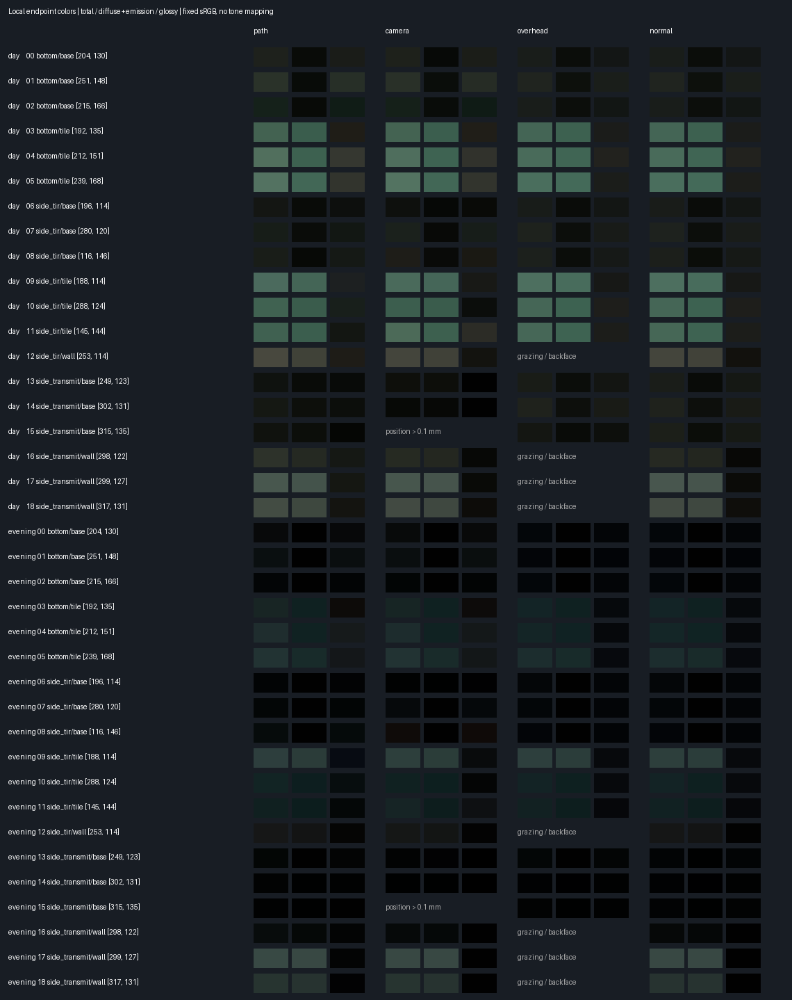

# 水の反射先の色を参照するための局所HDR試作

前回の[投影・遮蔽検証](../water-capture/README.md)に続き、到達点の色を別方向の画像から使い回せるかを測定する。**Cyclesの局所的な色参照の診断であり、ブラウザのHDRキャプチャや水面描画は未実装。暗い帯の修正は未完了。**

## 測定条件

- 入力は `water-side-continuation/trace-rays.json.gz` の元形状の到達点。カメラ03の静止状態から、経路（底／側面全反射／側面透過）×材質（タイル／石の内壁／基壇）の7群を抽出。各群を画面上の行・列で並べ、1/6・1/2・5/6の順位から選ぶ。1点しかない群は重複させず、合計19点。全10,058点の代表性を保証する無作為標本ではない。
- 昼・夕、到達直前の光線方向 `path`、元カメラ方向 `camera`、真上 `overhead`、面法線方向 `normal` を比較する。`normal` は内壁用の面座標マップを想定した方向。各カメラは到達点の1mm手前に置くため、元カメラからの遮蔽や投影・解像度の問題を含まない。
- 正投影10µm四方・5×5画素の中心画素を使用。Blenderの最小画像寸法は4×4のため、1×1を指定して先頭画素を読んだ試験出力は採用しない。元の材質・光源・水形状・間接反射・バウンス・クランプを保持。水面を通る最初の経路のFresnel係数・吸収は掛けていない。
- デノイズ・適応サンプリングなし。乱数seed=17/83の2回。EXRは32bitのscene-linear Rec.709。方向が幾何法線に対して裏面／接線（内積≥−0.001）なら描かない。Positionパスが到達点から0.1mmを超える場合は色比較から除く。
- `Diffuse=(DiffDir+DiffInd)*DiffCol`、`Glossy=(GlossDir+GlossInd)*GlossCol`、透過も同様。発光・環境を足してCombinedに一致することを検査する。[Blender 4.5のパス合成仕様](https://docs.blender.org/manual/en/4.5/render/layers/passes.html#combining)。

## 読み方

- [色見本](swatches.png)：各方向の3枠は左からCombined／拡散＋発光／鏡面。固定のsRGB変換だけで表示し、露出補正や枠ごとの正規化はしない。水面の完成画像ではない。
- [全HDR値と測定点](radiance.json)、[集計値](summary.json)、[1024サンプルの事前測定](convergence-1024.json)。EXR原本はGit管理外の `blender/diagnostics/water-radiance-16384/`。各ファイルのハッシュをJSONに保存。
- 方向差は2seed平均のRGB絶対差の合計を、同じ点のpath CombinedのRGB合計で割る。拡散・鏡面の誤差も**同じCombinedの分母**を使う。拡散欄は「参照画像の拡散＋発光に、正しいpathの鏡面を加えられた場合」の残差に相当するが、その鏡面取得方法は未実装。
- 2seed差は収束の目安であり信頼区間ではない。点・昼夕を等重みで集計し、画面上の面積や元の経路数では重み付けしていない。百分率は画質の合格率ではない。

## 結果（16384サンプル）

19点×昼夕×4方向×2seedで288枚を描画。真上は垂直な内壁・側面の4点（12・16・17・18）が裏面／接線のため8方向を描かない。点15の元カメラ方向は到達点から0.99mmずれ、4枚を比較から除外。パス合成とCombinedの差は最大1.47×10⁻⁶。

| 比較（Combinedの分母） | 件数 | 合計 中央値／90百分位／最大 | 拡散＋発光 | 鏡面 |
| --- | ---: | --- | --- | --- |
| 2seed差（path含む全方向） | — | 5.94% / 22.36% / 58.40% | 3.68% / 12.87% / 30.33% | 2.39% / 15.37% / 45.30% |
| 元カメラ方向 | 36 | 7.04% / 45.44% / 79.07% | 2.20% / 9.95% / 30.79% | 7.96% / 44.88% / 78.14% |
| 真上 | 30 | 19.34% / 61.43% / 88.65% | 3.89% / 12.44% / 18.23% | 19.32% / 61.28% / 75.62% |
| 面法線 | 38 | 15.64% / 67.80% / 120.64% | 3.29% / 9.87% / 12.36% | 17.13% / 65.70% / 127.46% |

- 拡散＋発光の方向差は、どの参照方向でも2seed差と同程度。この測定では、方向を変えて参照した拡散＋発光の誤差を雑音と区別できない。5%以内の比較は元カメラ29/36、真上16/30、面法線23/38。雑音以下と言えるほどの精度ではない。
- 鏡面の方向差は真上・面法線の中央値17〜19%、90百分位61〜66%で、2seed差の90百分位15.37%を大きく超える。鏡面を含むHDR色を別方向の画像から使い回す方式は採用できない。
- pathの鏡面はCombinedの10百分位9.33%・中央値33.01%・90百分位85.55%。鏡面を省略した場合の誤差はこの割合そのもので、省略も許容できない。
- 経路別の合計の中央値：底は元カメラ2.70%、真上19.34%、面法線19.40%。側面全反射は13.8〜19.0%、側面透過は21.3〜43.3%。底で元カメラ方向の誤差が小さいのは、最後の光線方向が元カメラに近いためと考えられるが、角度との関係は未集計。
- 1024サンプルの事前測定との平均値の差は、16384サンプルのCombinedに対し中央値12.73%・90百分位52.48%（最大は暗い点で555%）。1024サンプルの集計は収束していない参考値として残す。16384でも2seed差の90百分位は22%あり、小さな差の比較には不足する。



次は、真上＋内壁の面座標で拡散＋発光を参照し、鏡面だけを実際の最後の光線方向で近似する方式を比較する。鏡面の候補（反射プローブ・既存の環境マップ・省略）ごとにpathの鏡面との差を同じ分母で測る。雑音を下げるため、seed数の追加か点ごとの適応的な打ち切りを検討する。昼夕・別視点・動く波・GPU費用を測るまで製品への採用は保留。

検証：Blender 4.5.11 LTS正常終了（152秒、METAL）・元blendの実行前後ハッシュ一致、Python 32テスト（今回4件追加）、型検査、33ファイル171単体テスト、Lint、整形、本番ビルド、差分検査成功。製品コード・配信データは変更していないためブラウザ回帰は再実行していない。

## 再実行

```sh
/Applications/Blender.app/Contents/MacOS/Blender -b blender/scene/SUI_Retreat.blend --python-exit-code 1 --python scripts/diagnose_water_radiance.py -- --out blender/diagnostics/water-radiance-16384 --per-group 3 --samples 16384
python3 scripts/summarize_water_radiance.py blender/diagnostics/water-radiance-16384/radiance.json --out docs/3d-qa/water-radiance
python3 -m unittest discover -s scripts -p 'test_*.py'
```

元blendを保存しない。元blendと経路fixtureのハッシュを照合し、実行後も元blendのハッシュが変わらないことを検査する。製品コード・配信データは変更しない。
