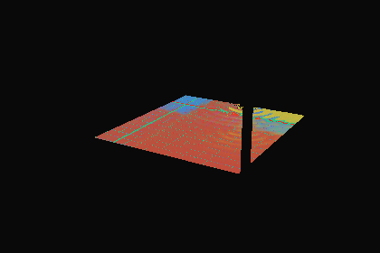

# 水中の到達点の鏡面ローブがどこへ向かうか（2026-09-26）

前回の[鏡面のプローブ近似](../water-specular/README.md)で、水中グリッドのL2プローブでは到達点の入射光の方向分布を表せないと分かった。今回は、到達点の鏡面ローブが元シーンのどこへ届くかを分類し、既存の参照で色を取れる割合を測る。**幾何の分類で、放射輝度は計算していない。製品・配信データは変更していない。暗い帯の修正は未完了。**

## 測定条件

- Blender 4.5.11 LTS、元blend。入力は [water-side-continuation](../water-side-continuation/) の元形状の到達点10,056点（カメラ03、420×280）と、[water-radiance](../water-radiance/) の代表19点。
- 到達点で、最後の経路区間の逆向きを視線とし、GGXの可視法線標本（配信GLBの粗さ：タイル・青銅0.3、石0.79）で鏡面方向を選ぶ。重みは単散乱のG2/G1×Schlick（スカラーF0）。全点64方向（8×8層化）、代表19点は1024方向。
- 方向ごとに元の水形状を通して追う（`water_reflection_trace.py`）。水の境界ではFresnelで反射・透過の両方に分岐し（水は滑らかとみなす。元の粗さ0.018）、最大8境界。重み1e-3未満の枝は打ち切り（`unresolved` に含める）。他の物体は光線種別（glossy／transmission）の可視性を守り、面光源の前面・点／スポット光の球も交差させる（昼夕の光源で2回実行）。
- 分類：
  - `pool_overhead`：水の範囲（元形状のXY±0.2m、上面以下）の面で、[water-capture](../water-capture/) と同じ真上の連続座標で同一物体・2mm以内に見える。**既存の真上参照で取れる**
  - `pool_face`：同範囲だが真上から見えない（垂直な内壁など）。前回までに候補とした面座標の参照が必要（未実装）
  - `sky`：水から抜けて何にも当たらない。ワールドは一様な背景色（Background＋出力のみ）で、製品の `scene.background` と同じ扱い。**既存の定数で取れる**
  - `above_water`：水面より上の物体。**既存の参照なし**
  - `light`：光沢／透過から見える光源の前面
- 太陽は面ではないため、`sky` のうち太陽円盤内の割合を別に記録した。

## 結果

全到達点の平均（昼、ローブ重み比、%）。夕は `sky`／`light` の差が0.4ポイント以内で、他は同じ。

| 最初の出口／到達材質 | 点数 | 真上 | 面座標 | 空 | 水上の物体 | 光源 | 未解決 |
| --- | ---: | ---: | ---: | ---: | ---: | ---: | ---: |
| 全体 | 10,056 | 28.1 | 7.5 | 7.1 | **55.1** | 0.1 | 2.0 |
| 底／タイル | 7,288 | 25.8 | 5.0 | 5.4 | **61.9** | 0.0 | 1.8 |
| 底／青銅 | 348 | 69.2 | 1.2 | 1.8 | 27.4 | 0.0 | 0.4 |
| 側面全反射／タイル | 1,655 | 29.3 | 1.7 | 17.8 | **47.9** | 0.4 | 2.8 |
| 側面全反射／青銅 | 56 | 77.5 | 0.4 | 7.1 | 14.5 | 0.1 | 0.3 |
| 側面透過／内壁 | 506 | 21.9 | **67.7** | 3.0 | 2.8 | 0.0 | 4.7 |
| 側面透過／青銅 | 75 | 84.0 | 8.2 | 3.5 | 4.0 | 0.0 | 0.3 |

- **既存の参照（真上＋空）で取れるのは平均35%**。点ごとの中央値27%、90百分位76%、90%以上を取れる点は5.4%だけ。
- 最大の到達先は**水面を抜けた水上の物体（55%）**。代表点の内訳では、水底から上へ向かう光線が水面の臨界角内から出る経路（`enter_bottom > exit_top`）が大半で、当たる先は奥の `Garden enclosure`、水面より上の内壁 `Plunge side basalt`／`Plunge end basalt`、縁石 `Honed pool coping`、ガラス壁・天蓋の柱など。
- 真上参照の28%の多くは、元形状の底と水の間の約15mmの空気層で水の底面に当たるFresnel反射と、青銅の基壇のくぼみの周りのタイル。
- 側面透過で内壁に届く点（暗い帯の右奥）は、鏡面の68%が真上から見えない向かいの内壁（面座標の参照が必要）。
- 光源は昼平均0.1%（最大の代表点でも1.7%）、太陽円盤は昼0%・夕0.003%。どちらも無視できる。水中の吸収（Volume Absorption 密度0.12）を掛けても全体平均の割合の変化は1.3ポイント以内（`mean_absorbed_fractions`）。
- 代表19点（1024方向）の値と点ごとの主な経路・物体は [targets.json](targets.json) の `selected`、全点の割合は [target-rows.json.gz](target-rows.json.gz)。



色は割合による混色：緑＝真上、黄＝面座標、青＝空、赤＝水上の物体、白＝光源、紫＝未解決。画面の大部分が赤みを帯び、奥の縁（側面全反射）が青、右奥の側面透過の領域が黄になる。夕は [targets-evening.png](targets-evening.png)。

## 判断

- 水中の真上・面座標の参照を実装しても、到達点の鏡面の半分以上（水上の物体）は取れない。拡散＋発光の参照（[water-radiance](../water-radiance/README.md)）とは別に、水上の物体を水中から見上げた色が必要。
- 次の候補は**水面の少し上に置いた1点の全周（キューブ）参照**で、水上の到達先を方向だけで引く方式。水上の物体は0.1〜数mの距離にあり視差が大きいので、次は `above_water` の到達点について、プール中央・水面上の1点から同じ方向に見た物体・距離との一致率（視差誤差）と、複数点の候補を測る。空はこの参照に含まれる。
- 鏡面の重みは幾何だけで、到達先の明るさは未評価。水上の物体の鏡面への寄与の大きさ（Cyclesの `GlossInd` のうちどれだけか）は、次の参照の試作で放射輝度を比較して確認する。

## 限界

- 放射輝度・色は未計算。重みはローブ×水境界のFresnelだけで、到達先の明るさで重み付けしていない。
- 単散乱GGX・スカラーのSchlick F0。Cyclesの多重散乱GGX・金属のF82とは異なる。粗さは配信GLBの値（石はColorRampの平均）で、テクスチャの変化・法線マップは含めない。
- viewport評価形状と幾何法線。水は滑らかな一枚の境界とし、他の透明材質は不透明として扱う。
- カメラ03・静止した波・元形状だけ。製品の水の形状（波＋箱）での同じ分類は行っていない。

## 再実行

```sh
/Applications/Blender.app/Contents/MacOS/Blender -b blender/scene/SUI_Retreat.blend --python-exit-code 1 --python scripts/diagnose_water_reflection_targets.py -- --out docs/3d-qa/water-reflection-targets
python3 -m unittest discover -s scripts -p 'test_*.py'
```

CPUのBVH追跡のみで約4.5分（描画なし）。`--samples`／`--selected-samples` で方向数、`--limit N` で先頭N点だけの試走。入力blend・経路・代表点・GLB・スクリプトのハッシュを `targets.json` に記録し、元blendの実行前後の一致を確認する（`source_unchanged`）。元blendは保存しない。
