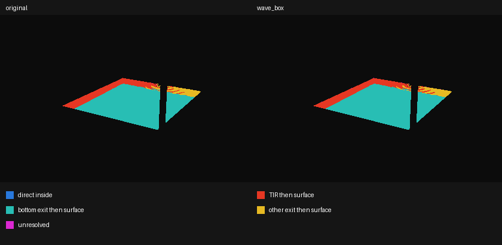

# 水側面で反射した後の到達先（2026-09-25）

前回の[最初の出口の診断](../water-side-paths/README.md)を、反射・透過後に物体へ届くところまで延長した。製品の描画・配信データは変更していない。**放射輝度を計算しておらず、暗い帯の色はまだ再現していない。**

## 測定結果

Blender 4.5.11 LTS、カメラ03、420×280、共通の可視水面10,058点。元形状の幾何法線と、現行Webの静止した波の法線＋元形状の箱を比較した。最初の出口の全分類・混同行列は前回と完全一致する。

元形状で最初に側面全反射する1,726点について：

| 全反射回数 | 点数 | 同領域での割合 |
| --- | ---: | ---: |
| 1回の後に透過して物体へ到達 | 1,591 | 92.18% |
| 2回の後に透過して物体へ到達 | 133 | 7.71% |
| 8回の診断上限に到達 | 2 | 0.12% |

- 到達材質は底のタイル1,655点（95.89%）、黒い金属の基壇56点、基礎の石9点、舗装3点、内壁の石1点。1,723点が水形状の底から透過し、1点は上面から出る。残り2点は未解決。**側面全反射を単に黒い壁として塗る近似では、反射先を表せない。**
- 最初に側面透過する581点は、すべて側面から出て内壁の石506点・基壇75点へ到達。全反射のタイル像とは別の経路になる。
- 今回は、水境界に達する前の物体交差は0点。到達した10,056点は水の外へ透過した後に当たる。元形状の底とタイルには隙間があるため、水の底をそのままタイルとみなすだけでは元の到達位置にならない。
- 8回上限の2点（画素254,114／261,116）は底・上面・側面を反射し続ける。箱候補では上限に達する点はない。この差を解消したとは扱わない。

## 箱候補の誤差

両方で物体に到達した10,049点の位置差。位置はBlenderのワールド座標で比較し、別の材質に届く点も含む。

| 対象（元形状の最初の出口で分類） | 位置差中央値 | 90百分位 | 99百分位 | 最大 |
| --- | ---: | ---: | ---: | ---: |
| 全体 | 1.18mm | 6.69mm | 188mm | 1.43m |
| 側面全反射 | 1.41mm | 11.76mm | 259mm | 1.43m |
| 側面透過 | 3.45mm | 59.99mm | 647mm | 722mm |
| 底 | 1.09mm | 4.79mm | 24.60mm | 771mm |

到達材質は9,769／10,058点（97.13%）で一致。波＋箱は7点が箱外への入射で未判定。材質境界や臨界角近くの少数点の大きい差は残る。前回の出口分類99.10%一致を、像の位置・色まで99%再現した意味には使えない。



赤＝全反射後に物体へ到達、青緑＝底から直接透過して到達、黄＝それ以外の面から透過して到達、紫＝未解決。青（境界より手前の物体）は今回0点。画像は到達材質や色のレンダーではない。左・奥の帯と右奥の透過領域を目視確認した。

## 次の描画試作への判断

1. **全反射は少なくとも2回まで評価する候補**とする。1回だけでは元形状の同領域の約7.8%が完結しない。底からの透過と、側面からの透過も評価し、上限・領域外は診断可能なフォールバックを設ける。
2. 主な到達先のタイル・内壁は配信GLBにある `V10 | submerged light / ...` 材質。既存の照度・コースティクスを使う候補にできるが、参照するのは**元の位置で評価した材質・光**である。現行 `refraction.ts` の頂点移動で作った画面をそのまま参照すると、既に屈折した像を再度曲げることになる。
3. 別のタイル像と画面外の到達先を扱うため、次は水風呂周辺だけの未屈折HDR描画を追加し、位置／深度との対応で参照する試作を候補とする。主画面だけの参照では、隠れた面や画面外を扱う追加策が必要。タイルだけでなく内壁・基壇・基礎も含める。描画パスの構成・投影方法・GPU費用はまだ検証していない。
4. 元の照度・発光を参照しても暗い帯の色が合う保証はない。鏡面は視線方向に依存し、透過にはFresnelと水中の吸収もある。採用前に03昼夕・水風呂の見下ろし・全周・動く波・軽量画質・解放を比較する。

## 再実行と検証

```sh
/Applications/Blender.app/Contents/MacOS/Blender -b blender/scene/SUI_Retreat.blend --python-exit-code 1 --python scripts/diagnose_water_paths.py -- --trace --out docs/3d-qa/water-side-continuation
python3 scripts/summarize_water_trace.py docs/3d-qa/water-side-continuation
python3 -m unittest discover -s scripts -p 'test_*.py'
```

[経路・材質別の集計](trace-summary.json)、[全光線の座標と境界イベント](trace-rays.json.gz)、[到達位置の比較](endpoint-comparison.json)、[検証記録](validation.json)。入力blend・診断コード・シーン定義・波実装のハッシュを記録し、元blendの実行前後一致を確認した。元blendは保存しない。

Python 26テスト（今回7件追加）・型検査・33ファイル171単体テスト・Lint・整形・本番ビルド・差分検査成功。最初のBlender実行で補助モジュールを読み込めず終了したため、スクリプトディレクトリをimportパスに追加して再実行した。3Dチャンク697.19KBの既存警告は継続。製品コード変更がないため、ブラウザ回帰・全周・継続検証は再実行していない。

## 限界

- viewport評価形状と幾何法線。Cyclesの補間法線・バンプ・放射輝度ではない。
- 全反射でなければ透過側だけを追う。Fresnelの反射分岐・吸収・他材質の透過は計算しない。
- 二次レイの可視性は直前の反射／透過に合わせる。レンダー非表示形状と元の水を除外し、他の透明材質も最初の物体として終了する。
- 水への再入射は未解決として停止（今回0点）。反射は最大8境界。箱の上限は元メッシュの最大高さ0.77145mで、入射位置は現行の平面0.765m。箱候補では上面への再到達は今回なかった。
- 一つのカメラ・静止した波・共通水面マスクの診断。輪郭・動き・モバイル・GPU性能・色の品質は未検証。
