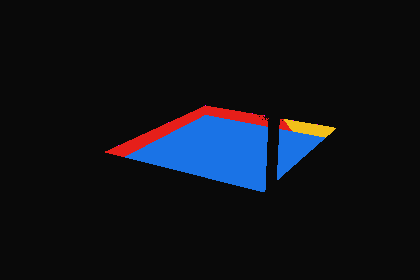
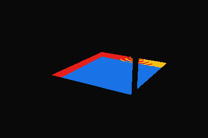

# 水形状の側面での全反射：近似方法の診断（2026-09-25）

前回の一時的なレイ診断を `scripts/diagnose_water_paths.py` として再実行可能にした。製品の描画は変更していない。元の水メッシュの**幾何法線で屈折したレイが最初に水形状を出る面**と、箱形近似の一致度を測る。Cyclesの放射輝度や暗い帯の色を再現した結果ではない。

## 測定と判断

Blender 4.5.11 LTS、元blendのカメラ03、420×280、可視水面10,058点。元の可視水面を全候補で共通にし、輪郭の違いは比較しない。入力blend・診断スクリプト・シーン定義・波の実装のSHA-256は [paths.json](paths.json) に記録。

| 候補 | 経路分類の一致率 | 全反射領域のIoU |
| --- | ---: | ---: |
| 元の水面からの屈折レイを保ち、出口だけ箱に置換 | 100% | 1.0000 |
| 平面の水面＋箱 | 97.65% | 0.8895 |
| 現行Webの静止した波の法線＋箱 | 99.10% | 0.9578 |

IoUは全反射判定領域の積集合÷和集合。元形状の分類は底7,751点・側面の全反射1,726点・側面から透過581点。底に分類したレイも、出口の前にタイルへ当たる可能性がある（今回は水形状だけの出口を測定）。

この視点では、元形状の底と側面を軸平行な箱で置き換えられる。上面の波を省くと、特に注水口付近の全反射と透過の境界がずれる。次の試作は**現行の波の法線＋元形状の箱**を候補にする。

元形状の範囲（glTF座標、m）は x=[−0.155, 2.515]、z=[−4.095, −0.905]、底y=0.215。上面は現行どおり平均y=0.765を使う。照明用の `WATER_BOX` は壁と石板を含む広い領域なので、屈折境界に流用しない。Webの水面表示の2.65×3.17mとも数cmの差があり、輪郭は別途確認が必要。

## 判定図

青＝底、赤＝側面で全反射、黄＝側面から透過、紫＝箱の外から入るため出口を未判定（平面・波の候補で各7点）。黒は比較対象外。柱など、レンダー対象の形状による遮蔽を除いた可視水面だけ。

| 元形状の幾何法線 | 平面＋箱 | 現行の波の法線＋箱 |
| --- | --- | --- |
|  |  |  |

`Scene.ray_cast` は `hide_render` の旧水形状も拾うため、レンダー非表示・カメラ不可視の交差を飛ばす。初回の診断には旧水形状による縞状の欠落があり、画像確認で検出して修正した。保存した結果は修正後のもの。

## 次の描画試作の条件

1. 水面上の画素から現在の波の法線で屈折させ、元形状の箱の側面と交差するかを判定する。水面下の材質を暗くするだけの係数は入れない。
2. 全反射時は側面で反射した方向の放射輝度が必要。まず一回反射後のタイル／壁への到達位置をオフラインで追跡し、そこで既存の照度・発光を使えるか調べる。側面透過と繰り返し反射も別の経路として記録する。
3. 現行の頂点屈折は一つの面を一つの像として描くため、別の反射像を自動では表せない。追加の水中描画パスや画面空間での参照を試す場合は、そのコストと画面外の扱いを評価する。
4. 採用時には03の昼夕に加え、水風呂ステージの見下ろし・全周、動く波、軽量画質、反射ターゲットの解放と継続検証を確認する。

## 限界

- 幾何法線を使い、Cyclesの補間されたシェーディング法線・材質のバンプは使わない。これはCyclesの正解レイとの厳密な照合ではない。
- viewportの評価済み形状。透明な可視形状は遮蔽物として扱う。底・側面までにある水中の物体、反射後の経路、放射輝度を測っていない。
- カメラ03・静止した波だけ。約99%の一致は画質の合格率ではなく、他視点・動く波・モバイルの証明でもない。
- 波の定数は `waterEffects.ts` のGLSLに合わせた丸め値を診断内に記載。波を変更した際は同期して再測定する。ハッシュで測定時の対応を残す。

## 再実行

リポジトリルートから：

```sh
/Applications/Blender.app/Contents/MacOS/Blender -b blender/scene/SUI_Retreat.blend --python-exit-code 1 --python scripts/diagnose_water_paths.py -- --out docs/3d-qa/water-side-paths
python3 -m unittest discover -s scripts -p 'test_*.py'
```

元blendは保存しない。NumPyはBlender同梱のものを使用する。`--width` で測定解像度を変更できる（既定420）。画像の成功を画質改善と扱わない。
